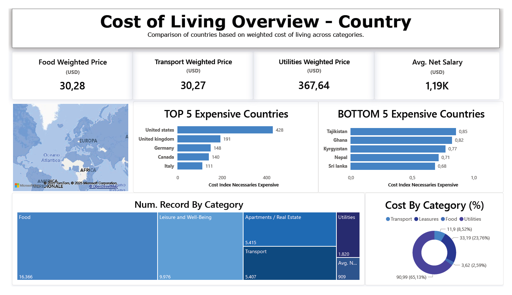
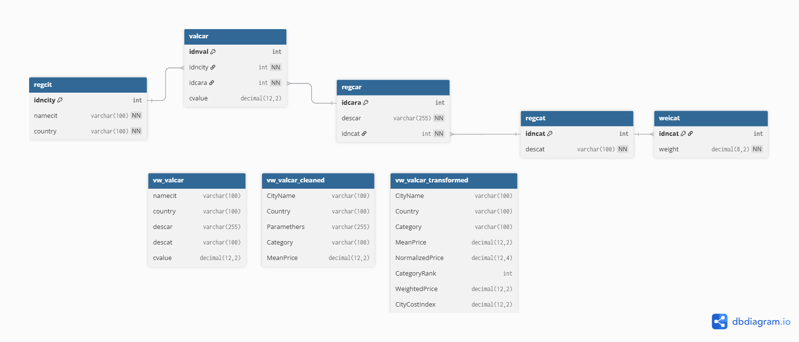

# Cost of Living - Data Engineering and Analysis Project

## Project Overview 
This project aims to **analyze and compare the cost of living across countries and cities**, combining multiple factors such as housing costs, living expenses, and average income. The goal is to identify the most affordable or “best value” places to live globally.

Key components:
- **Housing costs:** €/m² for buying and renting
- **Cost of living:** monthly expenses including food, utilities, transport, and leisure  
- **Income comparison:** assess affordability relative to average net salaries  

---

## Objectives
1. Compare the cost of living across different countries and cities.  
2. Assess how each expense category contributes to the total budget.  
3. Compare living costs with average income to evaluate affordability.
5. Explore individual categories for deeper insights (e.g., food, transport, leisure).

---

## Power-BI | Worksheet 1 - Overview |


**Notes** 
Full pdf report is available in [`report/PowerBI_report.pdf`](report/PowerBI_report.pdf).

---
# Repository Structure
```text

living-cost
│
├─ 📂 data
│  ├─ raw                # Raw datasets
│  └─ processed          # Results of extraction notebooks
│     └─ sql             # Mapped CSV for database
│
├─ 📂 database
│  ├─ er_diagram         # ER schema diagrams
│  └─ sql                # SQL schema files
│     ├─ insert          # static insert sql files
│     └─ views           # views sql files creation
│ 
├─ 📂 docs              
│  └─ img                # Img resulted exploring data with notebooks
│
├─ 📂 notebooks
│  ├─ database           # Notebooks for inserting data into DB
│  │  └─ mapping         # Mapping notebooks
│  ├─ extraction         # Data extraction notebooks
│  └─ exploration        # Data exploration notebooks
│
├─ 📂 powerbi            
│  └─ CostOfLiving.pbix  # Power bi file containing final report (TODO)
│
├─ 📂 report
│  └─ dashboard.png      # Dashboard's Overview and all of graphs .png (TODO)
│
├─ 📂scripts
│  ├─ bash               # Bash scripts
│  ├─ db_utils.py        # Database utility functions
│  └─ utils.py           # General utility functions
│
├─ .env
├─ .gitignore
├─ docker-compose.yml     # MySQL 8.0 container
├─ README.md
└─ requirements.txt
```

---
## General Pipeline
1. **Data Acquisition and Data Architecture** – Identify and gather relevant dataset. Creates Data Architecture.
2. **Data Cleaning** – Extract structured data from raw sources. Handle duplicates, missing values, and inconsistencies
3. **Data Transformation** – Compute KPIs, affordability indices, and additional metrics.  
4. **Data Loading** – Load clean data into Power BI for visualization.  
5. **Data Visualization** – Explore insights using Power BI.

---

## Detailed Pipeline

### 1. Identify dataset and load into database
- Identify and analyze dataset
- Prepare Python environment for ETL tasks.  
- Standardize and clean dataset columns.  
- Focus on mapping different categories for each characteristic/paramether.
- Set up MySQL database (via Docker).
- Design tables with proper relationships and data types.
- Load raw datasets into the database.

### 2. Data Cleaning
- Clean data by SQL view.
- Remove duplicates and whitespace.
- Handle incorrect or missing values.

### 3. Transform data
- Add calculated columns for KPIs and affordability indices.  
- Aggregate data by country/city or by category where relevant.  
- Map characteristics to predefined categories for consistent analysis.

### 4. Load data
- Export clean datasets as CSV files for external tools.  
- Load data into **Power BI** for visualization and reporting.

### 5. Data Visualization
- Power BI report to answer to all of the project's objectives.

**Example visualizations for Power BI:**
- **Generale - Overview worksheet:**  
  - Different Cards: Measure for each category.
  - Bar chart: TOP/BOTTOM 5 Expenses Countries.
  - Map: global visualization to filter data.
  - Pie chart: % Of cost categories relationship to the entire budget.
- **Specific - Category-specific worksheets (Filtered by cities):**
  - Total cost of meanPrice category
  - Bar charts comparing each paramether costs of the analysis. (Ex. Cate: food, paramethers: 1kg of bread, 1lt of milk, etc..)
  - Correlation of cost categories with average income

> **Note:** All steps are fully reproducible using Python scripts, SQL queries, and Power BI.

---

# Project Setup and Usage

The project is reusable by same dataset with added data.
It's enough to re-run all of notebooks that automatically populate the database.
Power BI is connected with docker container (MySQL) and take the data by a view that contains cleaned and transformed data.

## 1. Create and activate Python Environment
```bash
# Create a new virtual environment
python -m venv .venv

# Activate the environment
# On Windows:
.venv\Scripts\activate
# On macOS / Linux:
source .venv/bin/activate
```

## 2. Install Requirement Libraries
```bash
pip install -r requirements.txt
```

## 3. Environment Variables
Create a .env file at the project root to store database credentials and configuration:
```bash
DB_USER=<MYSQL_username>
DB_PASSWORD=<MYSQL_password>
DB_HOST=localhost
DB_PORT=3306
DB_NAME=livingcost
```
**Notes** 
⚠️ Never commit .env to version control — it contains sensitive data.

## 4. Run the database in docker
After you have created MySQL Setup with docker,

Start your MySQL database container:
```bash
docker-compose up -d
```

You can stop with:
```bash
docker-compose down
```

## 5. Launch jupyter notebook
To start exploring and running the project notebooks:
```bash
jupyter notebook
```

## MySQL Setup & Docker Guide

### Prerequisites
- Docker ([install guide](https://docs.docker.com/get-docker/))  
- Docker Compose ([install guide](https://docs.docker.com/compose/install/))  
- Command line access (`bash`, `cmd`, `PowerShell`)

### Docker Compose Configuration
Create `docker-compose.yml` in the project root:

```yaml
services:
  db:
    image: mysql:8.0
    container_name: livingcost_db
    restart: unless-stopped
    env_file:
      - .env
    ports:
      - "3306:3306"
    volumes:
      - db_data:/var/lib/mysql

volumes:
  db_data:
```

### Paramethers of docker container

- `MYSQL_DATABASE`: name of database created.
- `MYSQL_USER` e `MYSQL_PASSWORD`: user credentials.
- `ports`: map the port `3306` of container to your localhost.
- `volumes`: Save the data on db after stop container service too.

---

## Run MySQL

From directory where it is `docker-compose.yml`, run:

```bash
docker-compose up -d
```

### Check container status

```bash
docker ps
```

### Stop the container
```bash
docker stop livingcost_db
```

### Run mysql 
```bash
docker exec -it livingcost_db mysql -u <MYSQL_USER> -p
```

### See mysql logs
```bash
docker logs -f <CONTAINER_NAME>
```

---

## ⚙ Connecting Power BI

1. **Install MySQL Connector/NET**
  - Download from [MySQL Connector/NET](https://dev.mysql.com/downloads/connector/net/).
  - Install it to enable Power BI to connect to MySQL.

2. **Connect Power BI to MySQL**
  - Open Power BI → **Get Data → More → Database → MySQL database**
  - Enter the connection details:
    - **Server:** `localhost:3306`
    - **Database:** `cost_of_living_db`
    - **Username / Password:** as defined in Docker
  - Choose your authentication method and connect.

3. **Tips for Docker users**
   - Ensure the container’s port `3306` is mapped to the host.
   - If connecting fails, check firewall or network settings.
   - Restart Power BI after installing the MySQL Connector if the database isn’t detected.

---

## 📊 Reports

- Power BI reports are stored in the `reports/` folder as images.
- Reports show:
  - Weighted city cost index
  - Category-level comparisons
  - Normalized prices and rankings

---

## 📝 Notes

- The project uses **weighted averages** for the cost analysis, allowing users to adjust the importance of each category.
- All database tables and views are pre-populated for consistency.
- The CSVs can be used to update or extend data if needed.

---

## 💾 Usage

1. Start the Docker container
2. Load the schema and weights
3. Open Power BI and connect to the database
4. Load `vw_valcar_transformed` and create visualizations
5. Export images to the `reports/` folder if needed


---


## Database Schema Overview

### Main Tables
|         Table          |                     Description                              |
|------------------------|--------------------------------------------------------------|
| `regcit`               | Registry of cities and their respective countries            |
| `regcat`               | Master table for characteristic categories                   |
| `regcar`               | Registry of characteristics for cities (columns of dataset)  |
| `valcar`               | Values of characteristics for each city, grouped by category |
| `vw_valcar`            | Raw view of valcar table.                                    |
| `vw_valcar_cleaned`    | Cleaned data view of raw vw_valcar                           |
| `vw_valcar_transformed`| Transformed data view of vw_valcar_cleaned                   |


### ER Diagram


### Key Relationships
- Each `characteristic` belongs to a single `category` (`regcat`)  
- Each `value` is linked to a `characteristic` and a `country`  
- Categories allow aggregation and cross-country comparisons  

---

## 1. Data Acquisition and Data Architecture
Detailed information about data sources, extracted parameters, and extraction scripts is available in [`docs\EXTRACT_DATA.md`](docs/EXTRACT_DATA.md).

---

## 2. Data Cleaning and Exploration

Detailed information about data cleaning is available in [`docs\CLEANING_DATA.md`](docs/CLEANING_DATA.md).

---

## 3. Transform Data

Detailed information about data transforming is available in [`docs\TRANSFORM_DATA.md`](docs/TRANSFORM_DATA.md).

---

