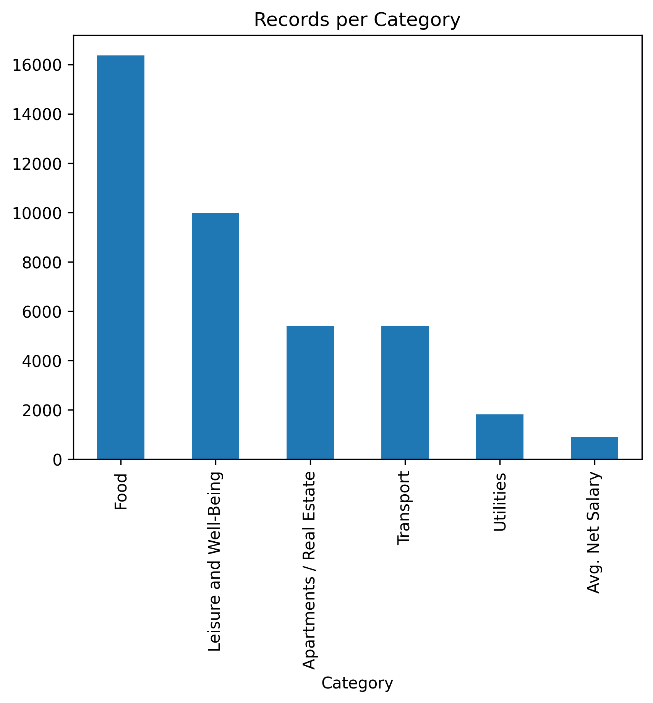
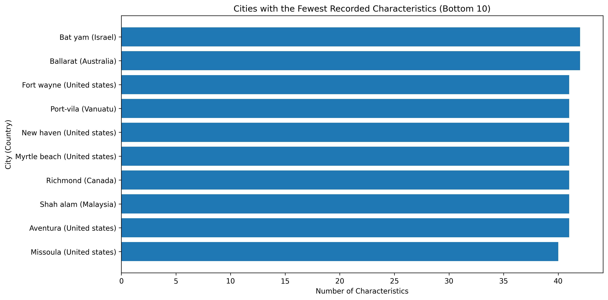

# Cost of Living - Data Engineering and Analysis Project


# Database Ready with all of views for powerBI

All datasets have been fully loaded into the database. 
Next steps will focus on Data Visualization (Power-BI).


## Project Overview
This project aims to **analyze and compare the cost of living across countries and cities**, combining multiple factors such as housing costs, living expenses, and average income. The goal is to identify the most affordable or “best value” places to live globally.

Key components:
- **Housing costs:** €/m² for buying and renting  
- **Cost of living:** monthly expenses including food, utilities, transport, and leisure  
- **Income comparison:** assess affordability relative to average net salaries  

---

## Objectives
1. Estimate the total cost of living in different countries and cities.  
2. Assess how each expense category contributes to the total budget.  
3. Compare living costs with average income to evaluate affordability.  
4. Identify regional patterns and differences in living expenses.  
5. Explore individual categories for deeper insights (e.g., food, transport, leisure).

---

# Repository Structure
```text

living-cost
│
├─ 📂 data
│  ├─ raw                # Raw datasets
│  └─ processed          # Results of extraction notebooks
│     └─ sql             # Mapped CSV for database
│
├─ 📂 database
│  ├─ er_diagram         # ER schema diagrams
│  └─ sql                # SQL schema files
│     ├─ insert          # static insert sql files
│     └─ views           # views sql files creation
│ 
├─ 📂 docs              
│  └─ img                # Img resulted exploring data with notebooks
│
├─ 📂 notebooks
│  ├─ database           # Notebooks for inserting data into DB
│  │  └─ mapping         # Mapping notebooks
│  ├─ extraction         # Data extraction notebooks
│  └─ exploration        # Data exploration notebooks
│
├─ 📂 powerbi            
│  └─ CostOfLiving.pbix  # Power bi file containing final report (TODO)
│
├─ 📂 report
│  └─ dashboard.png      # Dashboard's Overview and all of graphs .png (TODO)
│
├─ 📂scripts
│  ├─ bash               # Bash scripts
│  ├─ db_utils.py        # Database utility functions
│  └─ utils.py           # General utility functions
│
├─ .env
├─ .gitignore
├─ docker-compose.yml     # MySQL 8.0 container
├─ README.md
└─ requirements.txt
```

---
## General Pipeline
1. **Data Acquisition and Data Architecture** – Identify and gather relevant datasets. Creates Data Architecture.
2. **Data Cleaning** – Extract structured data from raw sources. Handle duplicates, missing values, and inconsistencies
3. **Data Transformation** – Compute KPIs, affordability indices, and additional metrics.  
4. **Data Loading** – Load clean data into a database and export for visualization.  
5. **Data Visualization** – Explore insights using Power BI.

---

## Detailed Pipeline

### 1. Identify datasets and load into database
- Prepare Python environment for ETL tasks.  
- Standardize and clean dataset columns.  
- Focus on mapping different categories for each characteristic/paramether.
- Set up MySQL database (via Docker).
- Design tables with proper relationships and data types.
- Load raw datasets into the database.

### 2. Data Cleaning
- Clean data by SQL view.
- Remove duplicates and whitespace.  
- Handle incorrect or missing values.  
- Standardize units (e.g., USD, liters, kg, €/m²).

### 3. Transform data
- Add calculated columns for KPIs and affordability indices.  
- Aggregate data by country/city or by category where relevant.  
- Map characteristics to predefined categories for consistent analysis.

### 4. Load data
- Export clean datasets as CSV files for external tools.  
- Load data into **Power BI** for visualization and reporting.

### 5. Data Visualization
**Main objectives:**  
1. How much it costs to live in different countries and cities.  
2. How each expense category contributes to the total budget.  
3. Affordability analysis relative to average income.  
4. Cross-country comparison of living costs.  
5. Category-specific exploration (food, housing, transport, leisure, utilities).

**Example visualizations for Power BI:**
- **World worksheet:**  
  - Card: €/m² for buying homes  
  - Bar chart: mean cost by category  
  - Map: global visualization of costs  
- **Category-specific worksheets:**  
  - Bar charts, line plots, or scatterplots comparing countries for specific categories  
  - Correlation of cost categories with average income

> **Note:** All steps are fully reproducible using Python scripts, SQL queries, and Power BI.

---

## 1. Data Acquisition and Data Architecture
Detailed information about data sources, extracted parameters, and extraction scripts is available in [`notebooks\extraction\README.md`](notebooks/extraction/README.md).  

Includes:  
- Raw living cost and housing parameters  
- Python/SQL scripts used for extraction  
- Notes on cleaning and formatting

---

## Database Schema Overview

### Main Tables
|         Table          |                     Description                              |
|------------------------|--------------------------------------------------------------|
| `regcit`               | Registry of cities and their respective countries            |
| `regcat`               | Master table for characteristic categories                   |
| `regcar`               | Registry of characteristics for cities (columns of dataset)  |
| `valcar`               | Values of characteristics for each city, grouped by category |
| `vw_valcar`            | Raw view of valcar table.                                    |
| `vw_valcar_cleaned`    | Cleaned data view of raw vw_valcar                           |
| `vw_valcar_transformed`| Transformed data view of vw_valcar_cleaned                   |

### Key Relationships
- Each `characteristic` belongs to a single `category` (`regcat`)  
- Each `value` is linked to a `characteristic` and a `country`  
- Categories allow aggregation and cross-country comparisons  

---

## 2. Data Cleaning and Exploration

### Records for each category after data cleaning


### Num Of paramethers for each city/country after data cleaning | Bottom 10

After cleaning and validating the dataset through SQL views, a coverage analysis was performed to understand how many parameters (characteristics) are available for each city.

The following chart shows the 10 cities with the fewest recorded characteristics, indicating where data coverage is limited:

This insight helps to identify cities with missing or incomplete data, which can later be excluded or handled carefully during transformation and visualization steps.




Detailed information about data cleaning is available in [`notebooks\exploration\README.md`](notebooks/exploration/README.md).


---

## 3. Transform Data

Detailed information about data transforming is available in [`docs\TRANSFORM_DATA.md`](docs/TRANSFORM_DATA.md).

---
## MySQL Setup & Docker Guide

### Prerequisites
- Docker ([install guide](https://docs.docker.com/get-docker/))  
- Docker Compose ([install guide](https://docs.docker.com/compose/install/))  
- Command line access (`bash`, `cmd`, `PowerShell`)

### Docker Compose Configuration
Create `docker-compose.yml` in the project root:

```yaml
services:
  db:
    image: mysql:8.0
    container_name: livingcost_db
    restart: unless-stopped
    env_file:
      - .env
    ports:
      - "3306:3306"
    volumes:
      - db_data:/var/lib/mysql

volumes:
  db_data:
```

### Paramethers of docker container

- `MYSQL_DATABASE`: name of database created.
- `MYSQL_USER` e `MYSQL_PASSWORD`: user credentials.
- `ports`: map the port `3306` of container to your localhost.
- `volumes`: Save the data on db after stop container service too.

---

## 3. Run MySQL

From directory where it is `docker-compose.yml`, run:

```bash
docker-compose up -d
```

### Check container status

```bash
docker ps
```

### Stop the container
```bash
docker stop livingcost_db
```

### Run mysql 
```bash
docker exec -it livingcost_db mysql -u <MYSQL_USER> -p
```

### See mysql logs
```bash
docker logs -f <CONTAINER_NAME>
```