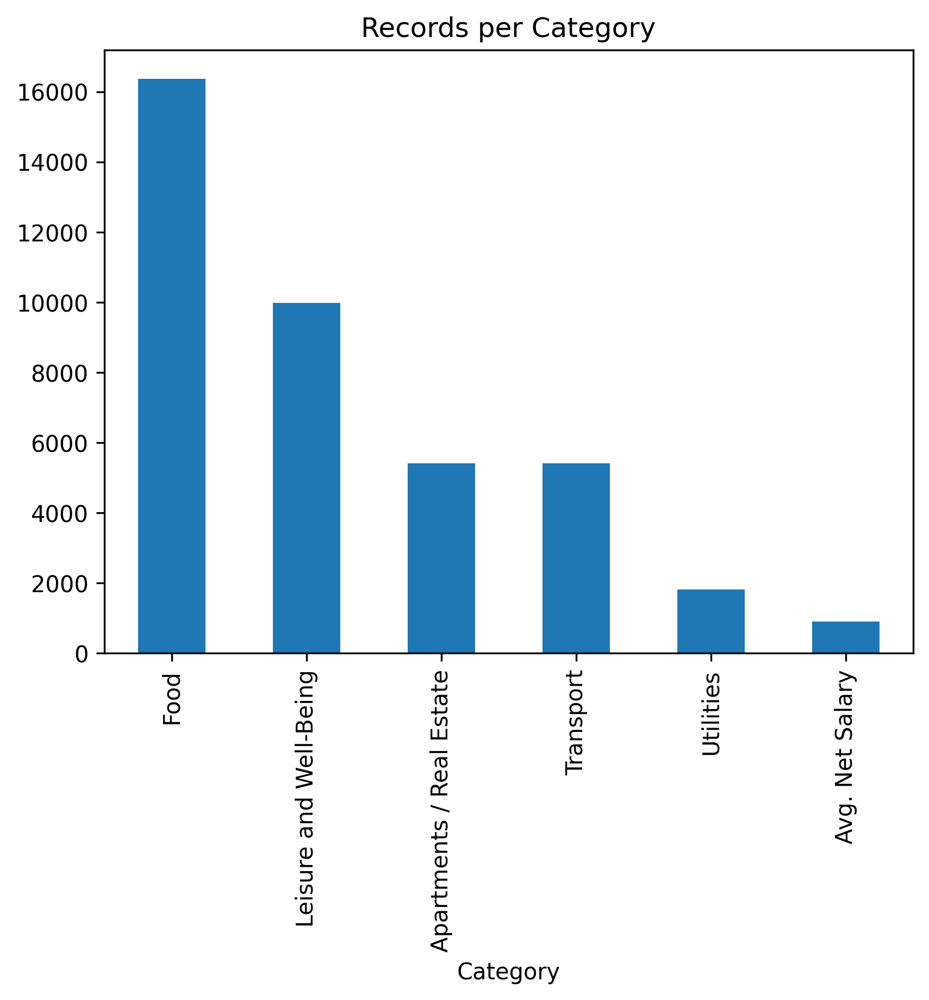
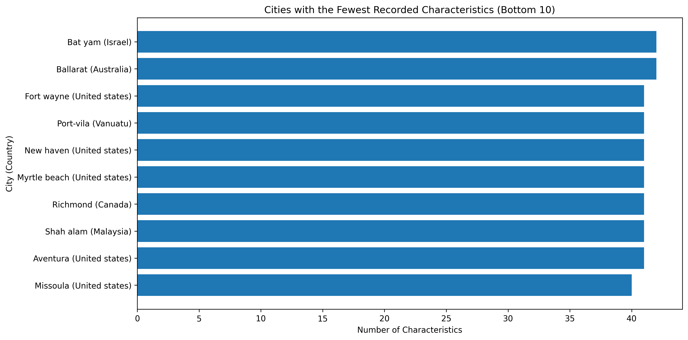

# 🧹 Data Cleaning & Exploration

## Overview
After building the database and mapping all characteristics, a deep **data cleaning** phase was performed directly on SQL views.  
The goal was to ensure **data consistency**, remove **invalid or missing values**, and prepare a **reliable analytical base** for further transformations and Power BI visualization.

### Cleaning process included:
- Removing null and negative values from the dataset  
- Standardizing city and country names (proper case formatting)  
- Normalizing characteristic names (underscores replaced with spaces, currency tags removed)  
- Filtering out duplicates and empty text fields  

All cleaned data are now accessible through the SQL view:

`vw_valcar_cleaned`

This view provides a unified dataset combining:
- City and Country  
- Characteristic (parameter)  
- Category  
- Mean Price (numerical value)

---

## 🧾 Dataset Summary After Cleaning
- **Total records:** ~40,000  
- **Distinct cities:** 910  
- **Distinct characteristics:** 44  
- **Distinct categories:** 6  

The dataset is now **clean**, **relationally consistent**, and **ready for analysis and visualization**.

---

## 📊 Distribution by Category (Records for each category after data cleaning)

The following chart represents the **distribution of cleaned records by category** (number of data points per category).  
It provides a first overview of how balanced the dataset is after the cleaning process.

## 📊 Number of records for each paramether by City/Country (Bottom 10)
After cleaning and validating the dataset through SQL views, a coverage analysis was performed to understand how many parameters (characteristics) are available for each city.

The following chart shows the 10 cities with the fewest recorded characteristics, indicating where data coverage is limited:

This insight helps to identify cities with missing or incomplete data, which can later be excluded or handled carefully during transformation and visualization steps.

---

Step 3 - Data Transformation: [`docs\TRANSFORM_DATA.md`](./TRANSFORM_DATA.md).
